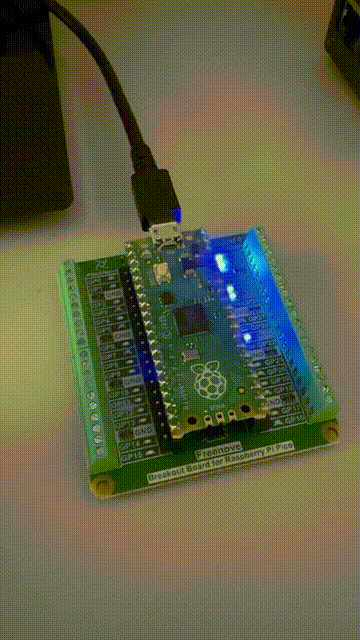

# blinky

In this repo I am dipping my toe for the first time in embedded programming with Rust, on my Raspberry Pi Pico microcontroller, trying to make an LED blink.



## Setup

The first step is to have [rustup](https://www.rust-lang.org/tools/install) installed and updated.

Next, we need to identify our build target, given that we know our device that we're going to be using is the Raspberry Pi Pico. We don't want to build a binary for the development machine architecture, which is what would happen by default.

The vendor specifies the RP2040 microcontroller chip. It's a dual-core ARM Cortex M0+ processor with up to 133MHz.

Armed with this identifier, we can look up the [RP2040 datasheet](https://datasheets.raspberrypi.com/rp2040/rp2040-datasheet.pdf) where we can find more info on the Cortex-M0+ Processor: namely that it implements the ARMv6-M Thumb instruction set.

This should be enough to now go to the [Rust Platform Support page](https://doc.rust-lang.org/beta/rustc/platform-support.html) and look up our Armv6-M and identify our target as `thumbv6m-none-eabi`. So we install it as a target with rustup.

```
> rustup target add thumbv6m-none-eabi
```
And verify:
```
> rustup show

...
installed targets:
  aarch64-apple-darwin
  thumbv6m-none-eabi
```

## The code

[Embassy](https://github.com/embassy-rs/embassy) is looking like a very exciting project for Rust embedded development, so I used their [examples](https://github.com/embassy-rs/embassy/tree/main/examples/rp) to get started.

Checking out the github repo and running the example worked very smoothly, but I wanted to replicate a self contained working example in this repo and that turned out to be quite tricky, as this is my first contact with embedded Rust and pretty much with Rust itself.

Nevertheless, I got it working in the end.

### Setting up

First, we can run
```
> cargo init
```
inside the project directory, because we had the project directory already. Otherwise, we could have run `cargo new blinky`.

We will also install the following tool for the release:
```
cargo install elf2uf2-rs
```

The `memory.x` file is taken from https://github.com/embassy-rs/embassy/blob/main/examples/rp/memory.x and is absolutely necessary.

And the following lines in Cargo.toml are meant to tell the Rust compiler to use the custom linker script:
```
[package.metadata.cortex-m-rt]
memory.x = true
```
The `build.rs` script is also needed for that. (also taken as-is from the embassy repo)

Also, the `.cargo/config.toml` file specifies the target and how to run the release (use `elf2uf2-rs` to flash to the Pico).

But fiddling with the dependencies turned out to be most tricky. Probably doesn't help that I didn't really know what I was doing there :) In the end, I copied the list of dependencies for Cargo.toml from the examples in the embassy repo and removed the obviously unneeded ones. Though I'm sure there's a lot of extras still left there. But I'll be learning more about that over time.


### Build and deploy

Build:
```
cargo build --bin blinky --release
```

And having connected the Pico2 to the Mac while keeping the `BOOTSEL` button pressed, run the following to flash and run:
```
cargo run --bin blinky --release
```
